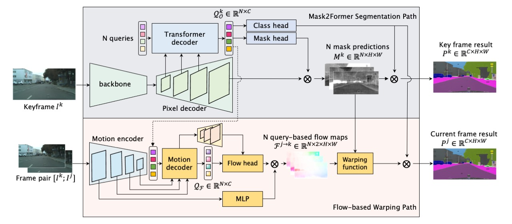

<h1 align="center">MPVSS: Mask Propagation for Efficient Video Semantic Segmentation</h1>


**[NeurIPS 2023] This is the official repository for our paper:** [MPVSS: Mask Propagation for Efficient Video Semantic Segmentation](https://arxiv.org/abs/2310.18954) by Yuetian Weng, Mingfei Han, Haoyu He, Mingjie Li, Lina Yao, Xiaojun Chang and Bohan Zhuang. 

## Introduction
We have presented a simple yet effective mask propagation framework, dubbed MPVSS, for efficient VSS. Specifically, we have employed a strong query-based image segmentor to process key frames and generate accurate binary masks and class predictions. Then we have proposed to estimate specific flow maps for each segment-level mask prediction of the key frame. Finally, the mask predictions from key frames were subsequently warped to other non-key frames via the proposed query-based flow maps.



------

## Installation
See [installation instructions](https://github.com/facebookresearch/Mask2Former/blob/main/INSTALL.md) for mask2former.

------

## Data preparation
1. Download vspw dataset from https://www.vspwdataset.com/
2. Create link to the dataset
```bash
ln -s /path/to/your/dataset datasets/vspw
```

------

## Train and Evaluation
```bash
sh run.sh
```

------

## Experimental Results

### VSPW
| Backbone | mIoU | WIoU | VC_8 | VC_16 | GFLOPs | #Params |  FPS  |
| ------ | ---- | ---- | ---- | ----- | ----- | ----- | --- |
|   R50    |  37.5    | 59.0  |  84.1  |  77.2     |  38.9     |  84.1   | 33.93 |
|   R101   | 38.8     |  59.0    |  84.8    | 79.6      |  45.1     |  103.1  | 32.38 |
|  Swin-T  |  39.9    |  62.0    |  85.9    |  80.4     | 39.7     |  114.0  | 32.86 |
|  Swin-S  |  40.4    |  62.0    |  86.0    |  80.7     |  47.3     |  108.0  | 30.61 |
|  Swin-B  |  52.6    |  68.4    |  89.5    |  85.9     |  61.5     |  147.0  | 27.38 |
|  Swin-L  |  53.9    |  69.1    | 89.6     |  85.8     |  97.3     |  255.4  | 23.22 |


### Cityscapes
| Backbone | mIoU | GFLOPs | #Params (M) | FPS   |
| ------ | -- | ---- | --------- | --- |
| R50      | 78.4     |   173.2     | 84.1        | 13.43 |
| R101     |  78.2    |  204.3      | 103.1       | 12.55 |
| Swin-T   |  80.7    |  175.9      | 114.0       | 12.33 |
| Swin-S   |  81.3    |  213.2      | 108.0       | 10.98 |
| Swin-B   | 81.7     |   278.6     | 147.0       | 9.54  |
| Swin-L   |  81.6    |     449.5   | 255.4       | 7.24  |

------

If you find this repository or our paper useful, please consider cite:
```
@inproceedings{weng2023mask,
  title={Mask Propagation for Efficient Video Semantic Segmentation},
  author={Weng, Yuetian and Han, Mingfei and He, Haoyu and Li, Mingjie and Yao, Lina and Chang, Xiaojun and Zhuang, Bohan},
  booktitle={NeurIPS},
  year={2023}
}
```

------

### Acknowledgement

The code is largely based on [Mask2Former](https://github.com/facebookresearch/Mask2Former). We thank the authors for their open-sourced code.
